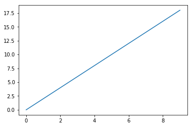
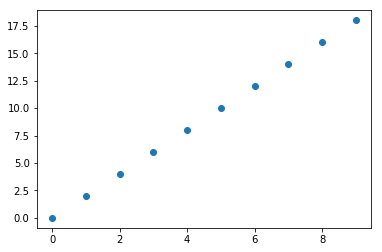
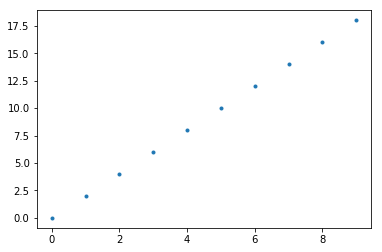
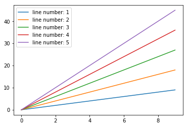
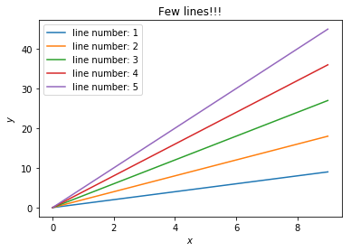

# **The Foundation of Applied Machine Learning**
## Spring 2019
### Instructor: [**Prof. Bahram Mobasher**](http://faculty.ucr.edu/~mobasher/)
### Teaching Assistance: [**Abtin Shahidi**](https://abtinshahidi.github.io/) email *abtin.shahidi--at--email.ucr.edu*

<br/>

# A general introduction to python 3

### Python is an interpreted, generel-purpose, and high-level programming language.
* The python code is automatically compiled to a byte code and then executed; which make it perfect for using it as scripting language. On the other hand languages such as C need to be compiled on the machine first then can be executed. (which make the program in C to be very fast)
* The python has built-in high level data structures: list, string, dictionary, tuple, ...
* Very large community which makes the debugging much easier as well as having access to a comprehensive standard library.
* Python supports multiple programming paradigms, including object-oriented, imperative, functional and procedural.


## Installing Python on your machine:

### Creating Virtual environment: (*optional but highly recommended*)
* It is a better practice to install python in a virtual environment to avoid any future dependency errors. For installing virtual enviroment you can use any of the following methods:
   1. [pipenv](https://pipenv.readthedocs.io/en/latest/)
   2. [venv](https://docs.python.org/3/library/venv.html)
   3. installing [conda](https://docs.conda.io/projects/conda/en/latest/index.html) (Package, dependency and environment management for any language) and using it's [environment manager](https://docs.conda.io/projects/conda/en/latest/user-guide/tasks/manage-environments.html).
   4. The most straight forward and easy to use way is to use [virtualenvwrapper](https://virtualenvwrapper.readthedocs.io/en/latest/index.html); it put all your packages in the same place, which makes it much easier to find and manage them after making tons of projects or virtual environment.


## Let's install virtualenvwrapper: (python 3)
### 1. Install [**pip**](https://pip.pypa.io/en/stable/installing/):

### &nbsp;&nbsp;&nbsp;&nbsp;&nbsp; **For installing on Ubuntu and Debian:**
### &nbsp;&nbsp;&nbsp;&nbsp;&nbsp; First update to make sure the package will be there:

```shell
sudo apt-get update
sudo apt-get upgrade
```
### &nbsp;&nbsp;&nbsp;&nbsp;&nbsp; Now install the pip3:
```shell
sudo apt-get install python3-pip
```


### &nbsp;&nbsp;&nbsp;&nbsp;&nbsp; **For installing on CentOS:**
```shell
sudo yum install python34-setuptools
sudo easy_install pip
```

### &nbsp;&nbsp;&nbsp;&nbsp;&nbsp; **For installing on Fedora:**
```shell
sudo dnf install python3-pip.
```

### 2.  Install [**virtualenv**](https://pypi.org/project/virtualenv/)

```shell
sudo pip3 install virtualenv

```

### 3.  Install [**virtualenvwrapper**](https://virtualenvwrapper.readthedocs.io/en/latest/index.html)
```shell
sudo pip3 install virtualenvwrapper
```

### 4. Setup the shell startup file
* Add the following lines to your shell startup file (.bashrc, .profile, etc.) to set the location which the virtual environments should be and the location of the script installed with this package:
```shell
export WORKON_HOME=$HOME/.virtualenvs
source /usr/local/bin/virtualenvwrapper.sh
```
* After editing it, reload the startup file (e.g., run source ~/.bashrc). Now test and build your own virtual-environment via command line:
```shell
mkvirtualenv temp
workon temp

pip3 install <packages>

deactivate
```
### **This is the full syntax for mkvirtualenv.** (requirement file is very useful when you have a list of needed packages and you want to install all of them with one command)
```shell
mkvirtualenv [-a project_path] [-i package] [-r requirements_file] [virtualenv options] ENVNAME
```
### <span style="color:#cc0000">_This is the way to install all the packages needed._</span>

### For checking the <span style="color:green">command references</span> for virtualenvwrapper check [https://virtualenvwrapper.readthedocs.io/en/latest/command_ref.html](https://virtualenvwrapper.readthedocs.io/en/latest/command_ref.html)

### ----> Now go ahead and build a Machine-learning virtual enviroment:
```shell
mkvirtual ML

workon ML

pip3 install numpy matplotlib
```

 One of the easiest ways to develop python codes (interactive feature) is to use [jupyter](https://jupyter.org/) notebook and [jupyter lab](https://github.com/jupyterlab/jupyterlab). They can be installed with pip3 install. But first make sure you have an updated version of pip installed:
```shell
pip3 install --upgrade pip
```
Then:

```shell
pip3 install jupyter
```

Now you can access jupyter notebook under your current directory if you type in the following:
```shell
jupyter notebook
```

If you want to install [jupyter lab](https://github.com/jupyterlab), run the following:
```shell
pip3 install jupyterlab
```
For further details click on the links below:

[jupyter](https://jupyter.readthedocs.io/en/latest/install.html)

[jupyter lab](https://jupyterlab.readthedocs.io/en/stable/getting_started/installation.html)


* Now you can check your installed packages by:

```shell
pip3 freeze
```

* And you can save them in a text file for future use:
```shell
pip3 freeze > requirement.txt
```

<br/>

# **Python as a simple calculator!!**


* It is very easy to define variables and do various calculation with them:


```python
3+2
```


    5


```python
7-4
```


    3


```python
# The syntax for devision is different in python 2
5/9
```


    0.5555555555555556


```python
4*20
```


    80


```python
x=10
y=20

print(x-y,x+y, x/y,x*y)
```

    -10 30 0.5 200


* **In interactive mode, the last printed expression is assigned to the variable _**


```python
x+y
```


    30


```python
20 + _
```


    52


```python
5 + _
```


    57

<br/>

# **Control Flow Tools**


## 1.**while** statement


```python
x=20
y=1

while y<x:
    y+=1

print(y,x)
```

    20 20


#### ---------------------------------------------------------------------


## 2. **If** statement


```python
x=20
y=1

if x!=2:
    y+=1
elif x!=3:
    y+=2
else:
    y+=10

print(y,x)
```

    2 20


#### ---------------------------------------------------------------------


## 3. **For** loop


```python
for i in range(4):
    print(i)
```

    0
    1
    2
    3


```python
list_1= [12,13,11,5]
for i in list_1:
    print(i)
```

    12
    13
    11
    5


### <span style="color:green">**More info:** </span>: [https://docs.python.org/3/tutorial/controlflow.html](https://docs.python.org/3/tutorial/controlflow.html)

<br/>

# **Built-in data structures**


## **1. Strings**

### &nbsp;&nbsp;&nbsp;&nbsp;&nbsp; It is relatively easy to work with strings in python

### &nbsp;&nbsp;&nbsp;&nbsp;&nbsp; <span style="color:Green">**Defenition**</span>:


```python
str_1="Today"
str_2="is"
str_3="Friday"

str_1+str_2
```


    'Todayis'


```python
str_1+" "+str_2
```


    'Today is'


```python
str_f=str_1+" "+str_2 + " " +str_3
str_f
```


    'Today is Friday'


### **Using the indexing for getting each character:** (remmeber that the index in python starts with 0)


```python
str_1[0]+str_1[2]
```


    'Td'


### Useful way when dealing with big strings


```python
("Hello" " " "World" "!!!")
```


    'Hello World!!!'


#### ---------------------------------------------------------------------

## **2. Lists**

### &nbsp;&nbsp;&nbsp;&nbsp;&nbsp; List are very useful objects for keeping a list of some data  

### &nbsp;&nbsp;&nbsp;&nbsp;&nbsp; <span style="color:Green">**Defenition**</span>:


```python
my_list_1 = [1,2,5,7,11,15,21]
my_list_2 = [1,12,"Hello"]

# Defenition of adding lists:
my_list_1+my_list_2
```


    [1, 2, 5, 7, 11, 15, 21, 1, 12, 'Hello']


* Finding the value with index and common use of indexing syntax:


```python
my_list_1[0]
```


    1


```python
my_list_1[-1]
```


    21


```python
my_list_1[3:6]
```


    [7, 11, 15]


```python
my_list_1[:6]
```


    [1, 2, 5, 7, 11, 15]


```python
my_list_1[3:]
```


    [7, 11, 15, 21]


* **Multiplying a list by a number:**
<span style="color:#cc0000">The number only can be integer. (else result in a TypeError)</span>


```python
3.2*my_list_1
```


    ---------------------------------------------------------------------------

    TypeError                                 Traceback (most recent call last)

    <ipython-input-41-0a94c0c5a776> in <module>
    ----> 1 3.2*my_list_1


    TypeError: can't multiply sequence by non-int of type 'float'


```python
3.*my_list_1
```


    ---------------------------------------------------------------------------

    TypeError                                 Traceback (most recent call last)

    <ipython-input-42-7c4df6de0708> in <module>
    ----> 1 3.*my_list_1


    TypeError: can't multiply sequence by non-int of type 'float'


```python
3*my_list_1
```


    [1, 2, 5, 7, 11, 15, 21, 1, 2, 5, 7, 11, 15, 21, 1, 2, 5, 7, 11, 15, 21]


### Exactly the same result if we did the following:


```python
my_list_1+my_list_1+my_list_1
```


    [1, 2, 5, 7, 11, 15, 21, 1, 2, 5, 7, 11, 15, 21, 1, 2, 5, 7, 11, 15, 21]


### **Common ways to create a list**


```python
# 1
my_list_1=[12,31,4]

# 2
my_list_2=[]
for i in my_list_1:
    my_list_2.append(i)
# 3    
my_list_3=[i for i in my_list_1]

print(my_list_1,my_list_2, my_list_3)
```

    [12, 31, 4] [12, 31, 4] [12, 31, 4]


#### ---------------------------------------------------------------------


## **3. Dictionary**

### &nbsp;&nbsp;&nbsp;&nbsp;&nbsp; Dictionaries in python are very useful and very fast since they use hashing algorithms.

### &nbsp;&nbsp;&nbsp;&nbsp;&nbsp; <span style="color:Green">**Defenition**</span>:


```python
my_dictionary={} # my_dictionary={key:value}
```


```python
keys=["hello", 12, 15, 11., "No", (12,9), "l"]
values=[12, 4, 1, "why", 14., " ", [12,41,5]]
```


```python
my_dictionary={keys[0]:values[0]}
my_dictionary
```


    {'hello': 12}


```python
my_dictionary={keys[0]:values[0], keys[1]:values[1]}
my_dictionary
```


    {'hello': 12, 12: 4}


```python
my_dictionary={key:value for key,value in zip(keys,values)}
my_dictionary
```


    {'hello': 12,
     12: 4,
     15: 1,
     11.0: 'why',
     'No': 14.0,
     (12, 9): ' ',
     'l': [12, 41, 5]}


### **Important**: <span style="color:#cc0000">The Key can be any immutable object such as strings, numbers, and tuples. However, the Value can be any object. (mutable and immutable)</span>


* **Few useful syntax for getting back the values, keys, (key,value) pairs:**


```python
my_dictionary["hello"]
```


    12


* <span style="color:#cc0000">If the key is not in the dictionary you going to get KeyError</span>


```python
my_dictionary["hell"]
```


    ---------------------------------------------------------------------------

    KeyError                                  Traceback (most recent call last)

    <ipython-input-63-f26ba78a1716> in <module>
    ----> 1 my_dictionary["hell"]


    KeyError: 'hell'


```python
my_dictionary.keys()
```


    dict_keys(['hello', 12, 15, 11.0, 'No', (12, 9), 'l'])


```python
my_dictionary.values()
```


    dict_values([12, 4, 1, 'why', 14.0, ' ', [12, 41, 5]])


```python
my_dictionary.items()
```


    dict_items([('hello', 12), (12, 4), (15, 1), (11.0, 'why'), ('No', 14.0), ((12, 9), ' '), ('l', [12, 41, 5])])


### **Special use in the for loops on the keys**, Both of the following ways are equivalent:


```python
for key in my_dictionary.keys():
    print(my_dictionary[key])
```

    12
    4
    1
    why
    14.0

    [12, 41, 5]


```python
for key in my_dictionary:
    print(my_dictionary[key])
```

    12
    4
    1
    why
    14.0

    [12, 41, 5]


### **We can make nested dictionaries very easy:**


```python
dict_1={"x":2, "y":[12,4]}

dict_2={"first_dict":dict_1}

dict_2
```


    {'first_dict': {'x': 2, 'y': [12, 4]}}


```python
dict_2["first_dict"]['x']
```


    2

<br/>

# **Importing packages and modules**


### **Different ways of calling a particular module/method (linspace)**


```python
# 1
import numpy
```


```python
numpy.linspace(1,10,20)
```


    array([ 1.        ,  1.47368421,  1.94736842,  2.42105263,  2.89473684,
            3.36842105,  3.84210526,  4.31578947,  4.78947368,  5.26315789,
            5.73684211,  6.21052632,  6.68421053,  7.15789474,  7.63157895,
            8.10526316,  8.57894737,  9.05263158,  9.52631579, 10.        ])


```python
# 2
import numpy as np # np is just a convention
```


```python
np.linspace(1,10,20)
```


    array([ 1.        ,  1.47368421,  1.94736842,  2.42105263,  2.89473684,
            3.36842105,  3.84210526,  4.31578947,  4.78947368,  5.26315789,
            5.73684211,  6.21052632,  6.68421053,  7.15789474,  7.63157895,
            8.10526316,  8.57894737,  9.05263158,  9.52631579, 10.        ])


```python
from numpy import linspace
```


```python
linspace(1,10,20)
```


    array([ 1.        ,  1.47368421,  1.94736842,  2.42105263,  2.89473684,
            3.36842105,  3.84210526,  4.31578947,  4.78947368,  5.26315789,
            5.73684211,  6.21052632,  6.68421053,  7.15789474,  7.63157895,
            8.10526316,  8.57894737,  9.05263158,  9.52631579, 10.        ])


<br/>

# Some Useful packages and modules:


## 1. **Numpy** look at the full [Documentation](https://docs.scipy.org/doc/numpy/reference/)

> ### NumPy provides efficient storage and better ways of handling data for Mathematical Operations


```python
import numpy as np
```

### Numpy arrays are relatively fast and have many useful features

### <span style="color:Green">**Defenition**</span>:


```python
my_list=[1,4,5]
x=np.array(my_list)
print(x)
```

    [1 4 5]


### _Notice that the elements are kept as integer. (as they were in the list)_

##### ----------------------------------------------


```python
my_list=[1.0,4,5]
x=np.array(my_list)
print(x)
```

    [1. 4. 5.]


### _Notice that the elements are turn into float. (even with only the first element was float in the list)_

##### ----------------------------------------------


```python
my_list=[1.0,4,5,"goods"]
np.array(my_list, dtype=np.int32)
```


    ---------------------------------------------------------------------------

    ValueError                                Traceback (most recent call last)

    <ipython-input-114-909efabe753f> in <module>
          1 my_list=[1.0,4,5,"goods"]
    ----> 2 np.array(my_list, dtype=np.int32)


    ValueError: invalid literal for int() with base 10: 'goods'


```python
my_array_0=np.array([12,5,6], dtype=complex)
my_array_0
```


    array([12.+0.j,  5.+0.j,  6.+0.j])


* For keeping the type you should use a list in which all the elements have the same type


```python
my_array_1=np.array([1,3,14.,15])
my_array_2=np.array([11,2,40.])
my_array_3=np.array([12,43,42.])

```


```python
my_array_2+my_array_2
```


    array([22.,  4., 80.])


```python
my_array_2-my_array_3
```


    array([ -1., -41.,  -2.])


```python
my_array_1+my_array_2
```


    ---------------------------------------------------------------------------

    ValueError                                Traceback (most recent call last)

    <ipython-input-118-64ed6476a96a> in <module>
    ----> 1 my_array_1+my_array_2


    ValueError: operands could not be broadcast together with shapes (4,) (3,)


```python
my_array_2*my_array_3
```


    array([ 132.,   86., 1680.])


```python
my_array_2/my_array_3
```


    array([0.91666667, 0.04651163, 0.95238095])


```python
3*my_array_1
```


    array([ 3.,  9., 42., 45.])


```python
my_array_3/6
```


    array([2.        , 7.16666667, 7.        ])


### **Indexing is like the lists**


```python
my_array_1[0]
```


    1.0


```python
my_array_1[-1]
```


    15.0


### **Choosing a subset:**


```python
my_array_1[my_array_1>4]
```


    array([14., 15.])


```python
my_array_1[my_array_1<4]
```


    array([1., 3.])


### **Making a simple matrix**


```python
qqq=np.array([[1,2],[4,5]])
```


```python
mqqq=np.asmatrix(qqq)
mqqq
```


    matrix([[1, 2],
            [4, 5]])


```python
qqq[0,0]
```


    1


```python
qqq[0][0]
```


    1


### _Notice that there is no difference_
###### -----------------------------------------------


```python
mqqq[0,0]
```


    1


```python
mqqq[0][0]
```


    matrix([[1, 2]])


### _Notice that there is a difference for two different way of getting value with the index_
###### -----------------------------------------------

## 2. **Matplotlib** look at the full [Documentation](https://matplotlib.org/users/index.html)

> ### Matplotlib is a Python 2D plotting library which produces publication quality figures in a variety of hardcopy formats and interactive environments across platforms.


### <span style="color:#cc0000">The matplotlib library is huge and it takes time to be familiar with it's features!</span>


```python
import matplotlib.pyplot as plt # plt is just a convention
```


```python
x=[i for i in range(10)]
y=[2*i for i in range(10)]


plt.plot(x,y)
plt.show()
```





```python
plt.scatter(x,y)
plt.show()
```





```python
plt.plot(x,y, '.')
plt.show()
```





### **It can be used in the for loop for several lines:**


```python
x=[i for i in range(10)]

for j in range(5):
    J=j+1
    y=[J*i for i in range(10)]
    plt.plot(x,y, label="line number: {}".format(J))

plt.legend()
plt.show()
```





### **Adding title and label for axis**


```python
x=[i for i in range(10)]

for j in range(5):
    J=j+1
    y=[J*i for i in range(10)]
    plt.plot(x,y, label="line number: {}".format(J))


plt.title(r"Few lines!!!")

plt.xlabel(r"$x$")
plt.ylabel(r"$y$")

plt.legend()
plt.show()
```





```python

```
